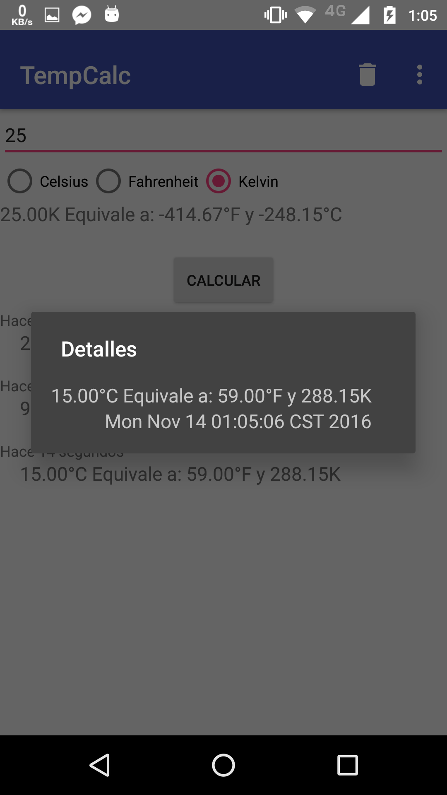

Calculadora de temperaturas
Video demostrativo
https://youtu.be/oYyzAM29s0c

Esta es mi aplicación TempCalc que convierte temperaturas.
El inputText tiene restricción de que el campo es requerido para realizar el cálculo.

Se inserta el número y se selecciona en qué escala se encuentra.
Abajo, mendiante RecyclerView se muestra hace cuánto fue hecha cada conversión así como los detalles de la misma.

Al presionar en cada elemento se abre la vista flotante de detalles, donde se muestra la conversión así como la fecha y hora en que fue realizada.

En la parte superior se encuentra el botón de limpiar lista, al cual se le debe dar confirmación de eliminación.

A su lado se encuentra en menú Acerca De, que muestra mi información personal en una avtividad flotante.
